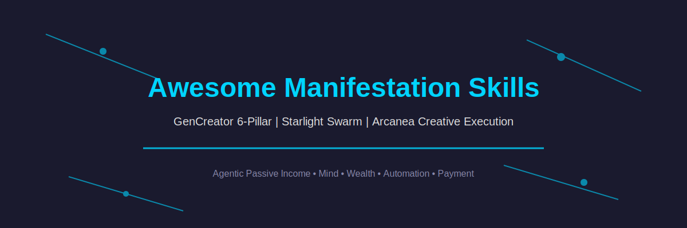
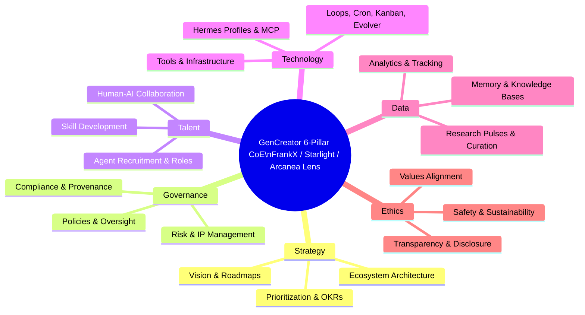

  

<h1 align="center">Awesome Manifestation Skills</h1>

  <strong>THE definitive curated list of manifestation agent skills, mind models, wealth protocols, belief systems, and agentic income loops | GenCreator 6-Pillar CoE • Starlight Swarm • Arcanea Creative Execution • Agentic Passive Income Systems</strong>

  <a href="#top-picks">Top Picks</a> ·
  <a href="#6-pillar-mapping">6-Pillar Mapping</a> ·
  <a href="#contents">Contents</a> ·
  <a href="#explore-the-full-frankx-awesome-ecosystem-17-lists">Full Ecosystem</a> ·
  <a href="CONTRIBUTING.md">Contribute</a>

> Curated through the GenCreator 6-Pillar CoE lens. This list maps the skills, agents, and systems that turn intention into reality — belief engineering, wealth manifestation, mind OS, and compounding agentic income.

## Why This List Exists

Manifestation is not woo-woo; it is the disciplined application of agentic systems to belief, attention, emotion, and action. This list fills the gap between generic "law of attraction" lists and rigorous, 6-Pillar-governed, local-first agent skills that actually compound into passive income and sovereign wealth.

We integrate:
- Mind Intelligence models (12-construct human mind)
- Agentic Passive Income frameworks
- Starlight provenance and Arcanea creative execution
- Gamification and wealth loops (cross-linked with lol-esports-llm-agents patterns)

## Contents

- [Top Picks](#top-picks)
- [Mind & Belief Skills](#mind--belief-skills)
- [Wealth & Income Manifestation](#wealth--income-manifestation)
- [Agent Loops & Evolver](#agent-loops--evolver)
- [6-Pillar Mapping](#6-pillar-mapping)
- [Explore the Full FrankX Awesome Ecosystem (17+ Lists)](#explore-the-full-frankx-awesome-ecosystem-17-lists)
- [Contribution & Provenance](#contribution--provenance)

## Top Picks

| Name | Description | Stars | Link | 6-Pillar Fit |
|------|-------------|-------|------|--------------|
| agentic-passive-income | Core framework for agentic passive income systems, loops, and compounding | 12 | https://github.com/frankxai/agentic-passive-income | Strategy, Data, Ethics |
| awesome-agentic-income | Curated list of income-generating agent skills | 8 | https://github.com/frankxai/awesome-agentic-income | All pillars |
| mind-intelligence-systems | 12-module human-mind model and ontology | 5 | https://github.com/frankxai/mind-intelligence-systems | Data, Ethics, Talent |
| lol-esports-llm-agents | Gamification and wealth through esports LLM agents | 3 | https://github.com/frankxai/lol-esports-llm-agents | Strategy, Talent, Ethics |

## Mind & Belief Skills

- [mind-palace-agent-skills](https://github.com/frankxai/mind-palace-agent-skills) - Blessing Protocol for turning work into memory palaces and belief reinforcement
- [agentic-mind-os](https://github.com/frankxai/agentic-mind-os) - Lived mind OS with weekly review loops
- [gstack skills](https://github.com/frankxai/gstack) - Foundational skills library including manifestation-aligned prompts

## Wealth & Income Manifestation

- [awesome-wealth-agent-skills](https://github.com/frankxai/awesome-wealth-agent-skills) - Wealth agent skills and investor loops
- [awesome-payment-agent-skills](https://github.com/frankxai/awesome-payment-agent-skills) - Payment rails, settlement, mandates for agentic income
- [awesome-investor-agent-skills](https://github.com/frankxai/awesome-investor-agent-skills) - Investor agent skills for portfolio manifestation

## Agent Loops & Evolver

- [gencreator-swarm-evolver](https://github.com/frankxai/gencreator-swarm-evolver) - Meta-orchestrator for continuous test/eval/experiment loops
- [agents-council](https://github.com/frankxai/agents-council) - Multi-agent council patterns for governance

## 6-Pillar Mapping

**Usage**: This taxonomy is embedded in every awesome-* list for consistent 6-Pillar positioning. Customize per-niche (e.g. Data heavy for mind lists).

## Explore the Full FrankX Awesome Ecosystem (17+ Lists)

Curated through the GenCreator 6-Pillar CoE lens • Starlight Swarm • Arcanea Creative Execution • Agentic Passive Income Systems

- [awesome-jarvis](https://github.com/frankxai/awesome-jarvis) (private - Jarvis meta-orchestrator)
- [awesome-manifestation-skills](https://github.com/frankxai/awesome-manifestation-skills)
- [awesome-agentic-income](https://github.com/frankxai/awesome-agentic-income)
- [awesome-hermes-agents](https://github.com/frankxai/awesome-hermes-agents)
- [awesome-ai-coe](https://github.com/frankxai/awesome-ai-coe)
- [awesome-design-agent-skills](https://github.com/frankxai/awesome-design-agent-skills)
- [awesome-music-agent-skills](https://github.com/frankxai/awesome-music-agent-skills)
- [awesome-agent-operating-systems](https://github.com/frankxai/awesome-agent-operating-systems) (reference pattern)
- [awesome-hermes-agent-skills](https://github.com/frankxai/awesome-hermes-agent-skills)
- [awesome-wealth-agent-skills](https://github.com/frankxai/awesome-wealth-agent-skills)
- [awesome-gamification-agent-skills](https://github.com/frankxai/awesome-gamification-agent-skills)
- [awesome-investor-agent-skills](https://github.com/frankxai/awesome-investor-agent-skills)
- [awesome-automation-agent-skills](https://github.com/frankxai/awesome-automation-agent-skills)
- [awesome-cosmos-ai-agents](https://github.com/frankxai/awesome-cosmos-ai-agents)
- [awesome-mind-agent-skills](https://github.com/frankxai/awesome-mind-agent-skills)
- [awesome-payment-agent-skills](https://github.com/frankxai/awesome-payment-agent-skills)
- [awesome-motion-design-agent-skills](https://github.com/frankxai/awesome-motion-design-agent-skills)

**Additional**: gstack skills, suno-e2e-workflow, heartmula, lol-esports-llm-agents for gamification/wealth.

## Contribution & Provenance

See [CONTRIBUTING.md](CONTRIBUTING.md) and provenance rules from awesome-hermes-agents/docs/provenance-and-naming.md.

Maintained via awesome-list-maintenance skill + gencreator-swarm-evolver. Last research pulse: 2026-07-01

Updated with mermaid 6-pillar, 17-list cross links, hero visual, .github templates.
