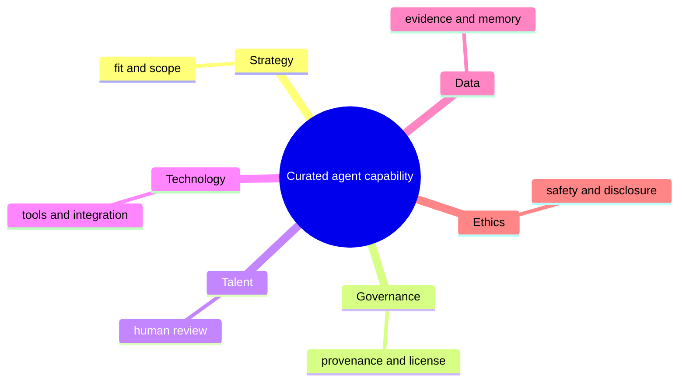

# Awesome Manifestation Skills

  

> Web-first tools for reflective, observable, human-owned practices—not guarantees of personal outcomes.

This is an independent, **web-first** catalog. It remains useful if every FrankX link is removed: third-party primary sources lead, while companion lists appear only at the end.

## Start here

Choose private capture, reusable routines, and a review cadence; do not treat an agent as a therapist or authority.

<!-- earned-skill-index:2026-08-30 -->

## Earned agent skills (start here)

Operators get leverage from **about 5–7 named workflows**, not bulk dumps. Hub: [https://github.com/frankxai/awesome-hermes-agent-skills](https://github.com/frankxai/awesome-hermes-agent-skills) · [earned index](https://github.com/frankxai/awesome-hermes-agent-skills/blob/main/docs/EARNED-SKILLS.md) · [safety gate](https://github.com/frankxai/awesome-hermes-agent-skills/blob/main/docs/QUALITY-AND-SAFETY.md).

**Reflective / planning skills**

| Pack | Job |
| --- | --- |
| [OthmanAdi/planning-with-files](https://github.com/OthmanAdi/planning-with-files) | Plans that survive compaction |
| [kepano/obsidian-skills](https://github.com/kepano/obsidian-skills) | Local notes / vault workflows |
| [obra/superpowers](https://github.com/obra/superpowers) | Honest planning + verification |
| [blader/humanizer](https://github.com/blader/humanizer) | Strip generic AI prose from journals |
| [NVIDIA/SkillSpector](https://github.com/NVIDIA/SkillSpector) | Scan before install |

Scan with [NVIDIA SkillSpector](https://github.com/NVIDIA/SkillSpector) before a live profile. Do not install unsigned ZIP/S3 skill blobs or OpenClaw mass dumps.

## Peer directories and standards

[agentskills/agentskills](https://github.com/agentskills/agentskills) · [VoltAgent/awesome-agent-skills](https://github.com/VoltAgent/awesome-agent-skills)

## Curated catalog

| Project | Pulse snapshot | Why it is here |
| --- | --- | --- |
| [Memos](https://github.com/usememos/memos) | MIT · 61,956★ | Markdown-native private capture. |
| [Logseq](https://github.com/logseq/logseq) | AGPL-3.0 · 44,214★ | Privacy-first linked review notes. |
| [Obsidian releases](https://github.com/obsidianmd/obsidian-releases) | NOASSERTION · 20,387★ | Official releases and plugin index. |
| [Agent Skills](https://github.com/agentskills/agentskills) | Apache-2.0 · 23,762★ | Portable, inspectable skill packages. |
| [Anthropic skills](https://github.com/anthropics/skills) | NOASSERTION · 165,802★ | Public skill collection; inspect boundaries. |
| [gstack](https://github.com/garrytan/gstack) | MIT · 125,927★ | Human-reviewed planning and QA loops. |

## 6-Pillar curation lens

```mermaid
mindmap
  root((Curated agent capability))
    Strategy
      fit and scope
    Governance
      provenance and license
    Talent
      human review
    Technology
      tools and integration
    Data
      evidence and memory
    Ethics
      safety and disclosure
```

This lens is editorial, not an endorsement or a claim that a project satisfies every pillar.

## Explore the Full FrankX Awesome Ecosystem (optional)

Companion catalogs are optional; the third-party projects above are this list's primary value.

- [awesome-jarvis](https://github.com/frankxai/awesome-jarvis) · [awesome-hermes-agents](https://github.com/frankxai/awesome-hermes-agents) · [awesome-manifestation-skills](https://github.com/frankxai/awesome-manifestation-skills) · [awesome-ai-coe](https://github.com/frankxai/awesome-ai-coe)
- [awesome-agentic-income](https://github.com/frankxai/awesome-agentic-income) · [awesome-investor-agent-skills](https://github.com/frankxai/awesome-investor-agent-skills) · [awesome-design-agent-skills](https://github.com/frankxai/awesome-design-agent-skills) · [awesome-agent-operating-systems](https://github.com/frankxai/awesome-agent-operating-systems)
- [awesome-music-agent-skills](https://github.com/frankxai/awesome-music-agent-skills) · [awesome-hermes-agent-skills](https://github.com/frankxai/awesome-hermes-agent-skills) · [awesome-gamification-agent-skills](https://github.com/frankxai/awesome-gamification-agent-skills) · [awesome-wealth-agent-skills](https://github.com/frankxai/awesome-wealth-agent-skills)
- [awesome-mind-agent-skills](https://github.com/frankxai/awesome-mind-agent-skills) · [awesome-cosmos-ai-agents](https://github.com/frankxai/awesome-cosmos-ai-agents) · [awesome-automation-agent-skills](https://github.com/frankxai/awesome-automation-agent-skills) · [awesome-payment-agent-skills](https://github.com/frankxai/awesome-payment-agent-skills) · [awesome-motion-design-agent-skills](https://github.com/frankxai/awesome-motion-design-agent-skills)

## Contribution standard

Open a PR with a primary URL, one-sentence distinct value, current maintenance evidence, license posture, and relevant safety/deployment caveat. Do not submit affiliate links, private workflow exports, unverified claims, or a product pitch in place of a useful third-party resource.

## Research method

This monthly pulse queried GitHub repository metadata on **2026-08-03** for identity, approximate stars, archived state, activity, and license posture. `NOASSERTION` means GitHub did not return a standard SPDX identifier; review the repository license before adoption. Counts are dated discovery signals, not rankings. Nothing here is financial, legal, medical, or safety advice.

Maintained as independent, web-first curation by FrankX. Last research pulse: **2026-08-30**.
